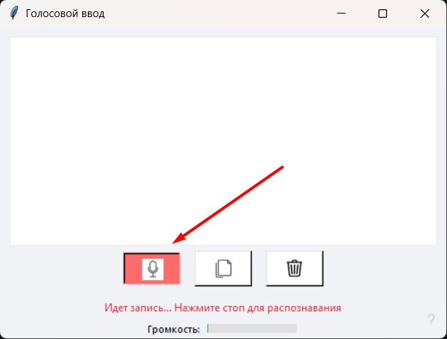

## Voice Input
___
### Что это?

**Voice Input** — это приложение на базе ИИ, написанное на Python, которое преобразует голосовую речь в текст.

## Установка

1. Скачайте актуальный релиз на странице GitHub Releases:  
   👉 https://github.com/boikov1977/voice-input/releases/tag/v1.0.0
2. Распакуйте содержимое архива `GigaAM-v3.zip` в ту же папку, где находится файл `voice-input.exe`.
3. Запустите `voice-input.exe`.

## Как пользоваться

1. Нажмите кнопку с микрофоном, чтобы начать запись.
2. Произнесите текст.
3. По завершении нажмите кнопку с микрофоном ещё раз, чтобы остановить запись.
4. Скопируйте распознанный текст из поля вывода.

## Скриншоты

### Ввод аудио

### Результат распознавания

В приложении используется модель GigaAM-v3 
https://huggingface.co/ai-sage/GigaAM-v3https://huggingface.co/ai-sage/GigaAM-v3

___
### What is this?
Voice Input is an AI-based application written in Python that converts spoken audio into text.

### Installation

* Download the latest release from the GitHub releases page:
👉 https://github.com/boikov1977/voice-input/releases/tag/v1.0.0

* Extract the contents of the GigaAM-v3.zip archive into the same directory as voice-input.exe.

* Run voice-input.exe.

### How to use

* Click the microphone button to start recording.

* Speak into the microphone.

* When you are finished, click the microphone button again to stop recording.

* Copy the generated text from the output field.

This application uses the GigaChad model:

https://huggingface.co/ai-sage/GigaAM-v3https://huggingface.co/ai-sage/GigaAM-v3
